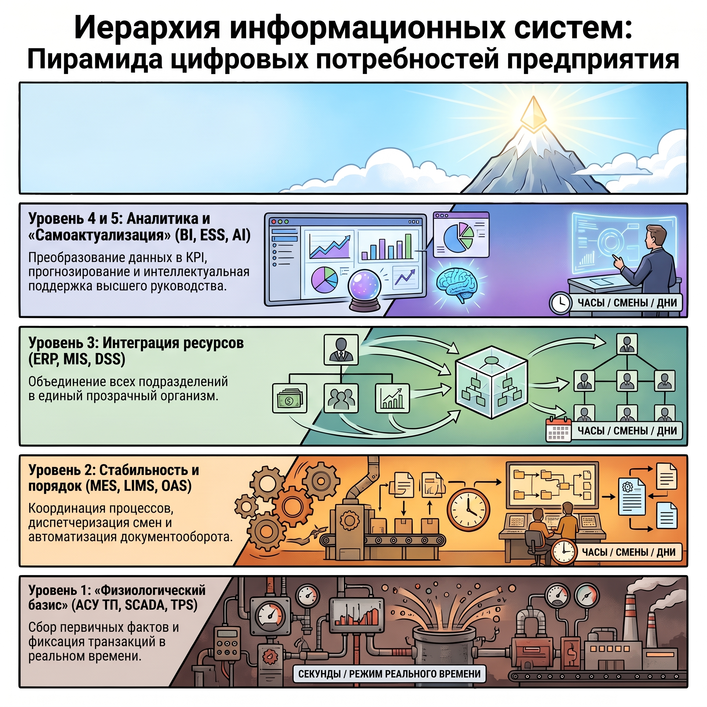

# Документация к работе над курсовым проектом

## Требования к работе

Общие требования на сайте: <https://se.ifmo.ru/courses/is>

Дополнительные персональные требования:

1. Интересная тема.
2. Строгий порядок защиты.
3. Прозрачная коллаборативная разработка .
4. Качественная отчетность.
5. Работа с проектной документацией.

Подробнее о каждом требовании далее.

### Интересная тема

Тема работы должна быть *интересной*. Это значит, что она должна быть:

1. **достаточно сложной**: реализовывать комплексную бизнес-логику, сопровождать
   несколько (>2) бизнес-процессов.

2. **достаточно практичной**: бизнес-процессы должны быть взяты из реальной
   жизни, целью разработки является осмысленная автоматизация, для оптимизации
   работы, но не наоборот.

3. **с четко определенной ЦА**: группа целевых пользователей
   системы должна быть подробно описана, включая ее прикладные цели (не задачи); отсюда определяется тип нагрузки, под которую система должна рассчитываться (OLAP/OLTP).

4. **интегрируемой**: система должна предоставлять API для взаимодействия с ней
   и/или сама интегрироваться с некоторой внешней системой.

5. **инновационной**: рекомендуется наличие элементов новизны —
   оригинальных научно-технических подходов или уникального прикладного
   функционала, уникального для рынка.

Для выбора темы можно руководствоваться классификацией информационных систем и
пирамидой потребностей в ИС, которая условно изображена [ниже](#иерархие-классов-информационных-систем).

### Порядок защиты

На каждый этап работы предполагается отдельный отчет. Каждый этап защищается
отдельно и последовательно, но фактический порядок разработки определяется
студентами самостоятельно.

> [!NOTE]
> Обычно последние 2 этапа разработки back- и front-end частей системы
  выполняется одновременно, но отчеты и защита все равно должны отвечать
  общим требованиям к работе.

### Прозрачная коллаборативная разработка 

Работа должна выполнять согласно стандартам коллаборативной разработки с
использованием системы контроля версий (git) и веб-сервиса предоставляющего
возможность делать проверку отдельных групп изменений (GitHub).

Практик должен иметь возможность проверить исходный код системы и сделать Review правок для отдельных этапов работы, оставлять комментарии к отдельным строчкам исходного кода. Для этого у него должен быть доступ в репозиторий вашего проекта с правами на Review.

### Качественная отчетность

Качественная отчетность подразумевает
- понимание цели отчета,
- удобный формат отчета для проверки.

#### Цель отчета

> [!IMPORTANT]
> В отчете должна быть только существенная и доступная информация для целевого
  читателя этого документа (преподавателя).

Отчет — это документ, который должен дать возможность увидеть наиболее важные
аспекты вашей работы, но не все возможные детали разработки. Поэтому нужно
качественно подходить к формированию его содержимого.

Кроме того, для предоставления информации в отчете следует выбирать наиболее доступные способы, это значит, что 
- не должно быть много сплошного текста,
- графические элементы (таблицы, диаграммы) предпочтительны для
  отображения сложных и важных связей.

Ознакомление с отчетом не должно занимать большого количества времени из-за
необходимости глубокого погружаться в тему. Дополнительно всегда можно дать
более подробное текстовое описание в основом содержимом отчета или в приложении,
если оно действительно требуется.

#### Формат отчета

Отчет представляет собой PDF-файл оформленный согласно стандартам.

Отчет следует выполняеть с применением текстового языка разметки, чтобы 
- иметь возможность удобно оставлять комментарии к содержимому прямо в интерфейсе
сервиса коллаборативной разработки (GitHub),
- шаблонизировать различные документы для единообразия,
- компилировать из него PDF-файл.

> [!TIP]
> Оптимальный вариант языка разметки — [Typst][typ], т.к. он обладает упрощенным
  синтаксисом в сравнении с LaTeX и схож с привычным Markdown. Он позволяет
  разрабатывать документы, как в Online-сервисе, так и локально с использованием
  всего лишь одной утилиты без множества зависимостей. Более того, есть готовый
  [шаблон typst-документа в формате ГОСТ][typ-template].

### Работа с проектной документацией.

В рамках первого этапа работы составляется спецификация требований к системе. Она следует стандартному формату, например, SRS. 

> [!IMPORTANT]
> **Спецификация** — это отдельный документ, отличный от **отчета** за этап.

Рекомендуется начинать с простых текстовых инструментов описания
предметной области, таких как User Story, которые станут основанием формирования подробных требований и пользовательских сценариев.

Также в спецификации следует использовать различные средства для визуализального
описания предметной области и требований к системе (не замена текстовым описаниям).

> [!TIP]
> Вам могут пригодиться
> - Use-Case диаграммы,
> - ER-диаграммы[^ER-slides][^ER-yndx][^ER-vid] (не путайте с даталогическими
>   моделями из 2 этапа), 
> - BPMN-диаграммы или диаграммы последовательности,
> - С4-cхемы архитектуры (первые 2 уровня) и пр. 
> - Техника User Story Mapping для планирования работы.

В ходе работы может появляться потребность в изменении требований. Все изменения
требований должны согласовываться с практиком и в отчет должна помещаться
аргументация предложенных изменений. Не должно быть молча внесённых изменений в
спецификацию, потому что это влечёт проблемы во время приёмки (защиты) проекта.

Короче говоря, каждый этап — это отдельный Pull Request со всеми изменениями для
выполнения этапа после выполнения предыдущего этапа с учетом изменений в
спецификации на разработку и отдельного отчета по выполнению этапа.

[typ]: https://typst.app/
[typ-template]: https://github.com/e1turin/typst-docs-template

## Иерархие классов информационных систем

[^ER-slides]: https://foreva.susu.ru/courses/db/lecture3.pdf
[^ER-yndx]: https://practicum.yandex.ru/blog/chto-takoe-er-diagramma/
[^ER-vid]: https://www.youtube.com/watch?v=hsaLKYdOdsE
